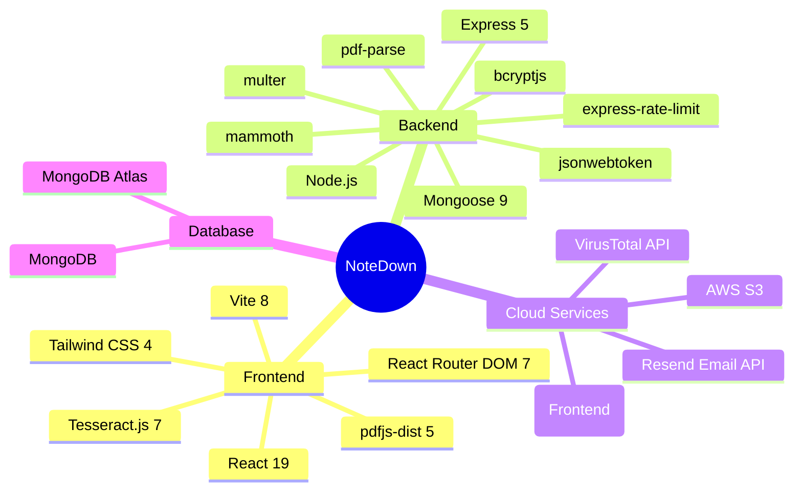
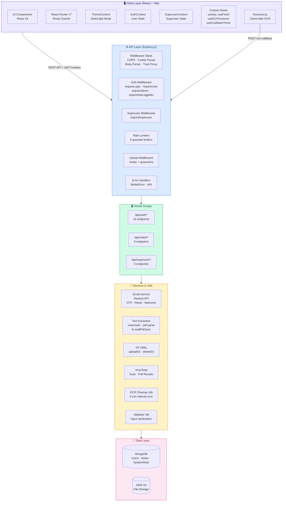
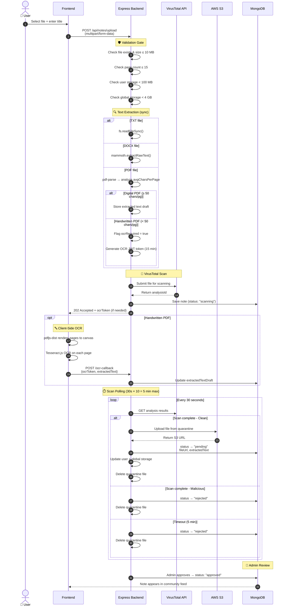
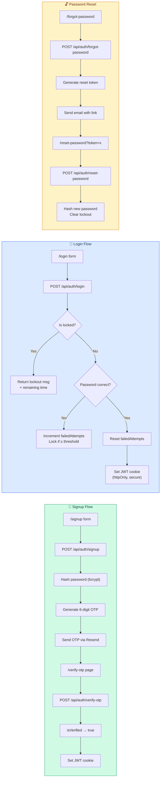
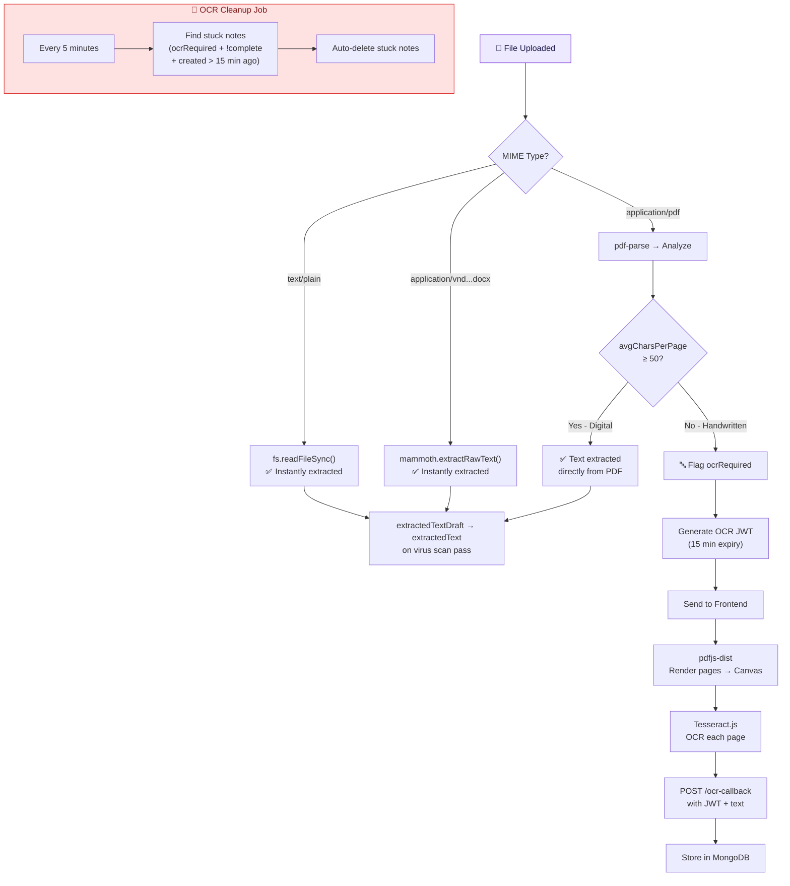
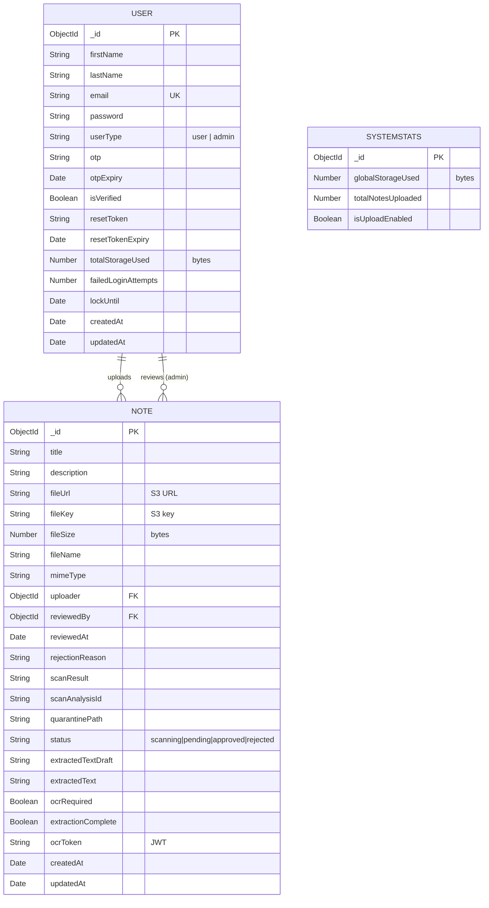

<div align="center">


<br/>

**Transform your handwritten notes, PDFs, and documents into intelligent, queryable study materials.**

<br/>

<a href="https://note-down-sooty.vercel.app">
  
</a>

<br/><br/>


<br/><br/>


</div>

<br/>

---

## 📑 Table of Contents

- [About The Project](#-about-the-project)
- [Features & Progress](#-features--progress)
- [Tech Stack Deep Dive](#%EF%B8%8F-tech-stack-deep-dive)
- [System Architecture](#-system-architecture)
- [Upload & Security Pipeline](#-upload--security-pipeline)
- [Authentication Flow](#-authentication-flow)
- [OCR & Text Extraction Engine](#-ocr--text-extraction-engine)
- [Project Structure](#-project-structure)
- [API Reference](#-api-reference)
- [Database Schema](#-database-schema)
- [Getting Started](#-getting-started)
- [Deployment](#-deployment)
- [Roadmap](#-roadmap)
- [Contributing](#-contributing)
- [License](#-license)

---

## 🎯 About The Project

**NoteDown** is a full-stack, AI-ready study platform where students can upload study materials (PDFs, DOCX, TXT, images), have them automatically virus-scanned by **70+ antivirus engines** via the VirusTotal API, go through admin approval, and then be shared with the community. The platform extracts text intelligently — using server-side `mammoth` and `pdf-parse` for digital documents, and client-side **Tesseract.js OCR** for handwritten/scanned PDFs.

The project implements a robust **3-tier role system** (User → Admin → Superuser), each with distinct permissions, dashboards, and separate authentication flows. Every file is stored securely on **AWS S3** with per-user storage quotas (100 MB) and a global storage cap (4 GB).

The long-term goal is a full AI-powered conversational experience using **LangChain + Gemini API + MongoDB Vector Search** — enabling students to "chat" with their notes.

---

## ✨ Features & Progress

<table>
<thead>
<tr>
<th align="center">🔒 Security & Auth</th>
<th align="center">Status</th>
</tr>
</thead>
<tbody>
<tr><td>JWT-based cookie authentication (httpOnly, secure)</td><td align="center">✅</td></tr>
<tr><td>Email signup with OTP verification (6-digit, 5-min expiry)</td><td align="center">✅</td></tr>
<tr><td>Forgot password → email reset token flow</td><td align="center">✅</td></tr>
<tr><td>Profile in-app password reset with OTP</td><td align="center">✅</td></tr>
<tr><td>Login lockout after failed attempts (DB-persisted)</td><td align="center">✅</td></tr>
<tr><td>9 granular rate limiters (signup, login, OTP, upload, etc.)</td><td align="center">✅</td></tr>
<tr><td>VirusTotal malware scanning on every upload</td><td align="center">✅</td></tr>
<tr><td>Role-based route guards (user / admin / superuser)</td><td align="center">✅</td></tr>
</tbody>
</table>

<table>
<thead>
<tr>
<th align="center">📝 Notes & Storage</th>
<th align="center">Status</th>
</tr>
</thead>
<tbody>
<tr><td>File upload (PDF, DOCX, TXT) with multer + quarantine</td><td align="center">✅</td></tr>
<tr><td>AWS S3 cloud storage with unique key-per-user</td><td align="center">✅</td></tr>
<tr><td>Per-user storage tracking (100 MB limit)</td><td align="center">✅</td></tr>
<tr><td>Global storage tracking (4 GB) with auto-disable</td><td align="center">✅</td></tr>
<tr><td>Page count validation (max 15 pages)</td><td align="center">✅</td></tr>
<tr><td>Note deletion with S3 cleanup & storage recalculation</td><td align="center">✅</td></tr>
<tr><td>Admin approval/rejection workflow for public notes</td><td align="center">✅</td></tr>
<tr><td>View approved community notes feed</td><td align="center">✅</td></tr>
</tbody>
</table>

<table>
<thead>
<tr>
<th align="center">🧠 Text Extraction & OCR</th>
<th align="center">Status</th>
</tr>
</thead>
<tbody>
<tr><td>TXT file extraction (server-side, fs.readFileSync)</td><td align="center">✅</td></tr>
<tr><td>DOCX extraction via mammoth.js (server-side)</td><td align="center">✅</td></tr>
<tr><td>Digital PDF extraction via pdf-parse (server-side)</td><td align="center">✅</td></tr>
<tr><td>Handwritten PDF detection (avgCharsPerPage < 50)</td><td align="center">✅</td></tr>
<tr><td>Client-side OCR via Tesseract.js + pdfjs-dist (browser)</td><td align="center">✅</td></tr>
<tr><td>JWT-secured OCR callback pipeline</td><td align="center">✅</td></tr>
<tr><td>OCR cleanup cron job (auto-reject stuck notes after 15 min)</td><td align="center">✅</td></tr>
</tbody>
</table>

<table>
<thead>
<tr>
<th align="center">💅 UI/UX & Frontend</th>
<th align="center">Status</th>
</tr>
</thead>
<tbody>
<tr><td>Landing page with hero, features grid, how-it-works</td><td align="center">✅</td></tr>
<tr><td>Dark mode with OS preference detection & persistence</td><td align="center">✅</td></tr>
<tr><td>Responsive hamburger drawer nav with Escape-to-close</td><td align="center">✅</td></tr>
<tr><td>CSS variable theming with Tailwind dark class strategy</td><td align="center">✅</td></tr>
<tr><td>Unified NoteCard component (reused across 3+ pages)</td><td align="center">✅</td></tr>
<tr><td>StorageBar component with visual progress</td><td align="center">✅</td></tr>
<tr><td>Global loading interceptor via useApi hook</td><td align="center">✅</td></tr>
<tr><td>Profile page with edit modal & password reset section</td><td align="center">✅</td></tr>
<tr><td>OTP cooldown timer hook (useCooldownTimer)</td><td align="center">✅</td></tr>
<tr><td>404 Not Found page</td><td align="center">✅</td></tr>
</tbody>
</table>

<table>
<thead>
<tr>
<th align="center">👑 Superuser Panel</th>
<th align="center">Status</th>
</tr>
</thead>
<tbody>
<tr><td>Separate superuser login page & JWT auth</td><td align="center">✅</td></tr>
<tr><td>System stats dashboard (global storage, total notes)</td><td align="center">✅</td></tr>
<tr><td>Admin CRUD (add/delete admins from superuser panel)</td><td align="center">✅</td></tr>
<tr><td>Welcome email sent to new admins via Resend</td><td align="center">✅</td></tr>
</tbody>
</table>

<table>
<thead>
<tr>
<th align="center">🤖 AI Features (Planned)</th>
<th align="center">Status</th>
</tr>
</thead>
<tbody>
<tr><td>MongoDB Vector Search embeddings on extracted text</td><td align="center">🚧</td></tr>
<tr><td>LangChain + Gemini API conversation engine</td><td align="center">🚧</td></tr>
<tr><td>"Chat with your notes" interface</td><td align="center">🚧</td></tr>
<tr><td>AI summarization of uploaded documents</td><td align="center">🚧</td></tr>
</tbody>
</table>

---

## 🛠️ Tech Stack Deep Dive



<details>
<summary><b>📦 Frontend Dependencies Breakdown</b></summary>

| Package | Version | Purpose |
|---|---|---|
| `react` | ^19.2.4 | UI component library |
| `react-dom` | ^19.2.4 | React DOM renderer |
| `react-router-dom` | ^7.13.2 | Client-side routing & navigation guards |
| `tailwindcss` | ^4.2.2 | Utility-first CSS framework |
| `@tailwindcss/vite` | ^4.2.2 | Tailwind Vite plugin |
| `tesseract.js` | ^7.0.0 | Client-side OCR for handwritten PDFs |
| `pdfjs-dist` | ^5.6.205 | PDF rendering to canvas for OCR pipeline |
| `vite` | ^8.0.1 | Build tool & dev server |

</details>

<details>
<summary><b>📦 Backend Dependencies Breakdown</b></summary>

| Package | Version | Purpose |
|---|---|---|
| `express` | ^5.2.1 | HTTP server framework |
| `mongoose` | ^9.3.2 | MongoDB ODM |
| `mongodb` | ^7.1.1 | MongoDB native driver |
| `@aws-sdk/client-s3` | ^3.1018.0 | AWS S3 file upload / deletion |
| `bcryptjs` | ^3.0.3 | Password hashing |
| `jsonwebtoken` | ^9.0.3 | JWT creation & verification |
| `express-rate-limit` | ^8.3.1 | API rate limiting |
| `express-validator` | ^7.3.1 | Request validation |
| `multer` | ^2.1.1 | Multipart form / file upload handling |
| `mammoth` | ^1.12.0 | DOCX → plain text extraction |
| `pdf-parse` | ^2.4.5 | Digital PDF text extraction |
| `resend` | ^6.9.4 | Transactional email (OTP, password reset, welcome) |
| `cookie-parser` | ^1.4.7 | Parse cookies from requests |
| `cors` | ^2.8.6 | Cross-origin resource sharing |
| `dotenv` | ^17.3.1 | Environment variable management |
| `body-parser` | ^2.2.2 | Request body parsing |
| `lodash` | ^4.18.1 | Utility functions |
| `form-data` | ^4.0.5 | Form data construction for VirusTotal API |

</details>

---

## 🏗 System Architecture

The application follows a **4-tier architecture** with clear separation of concerns:



---

## 🔐 Upload & Security Pipeline

Every uploaded file goes through a **multi-stage security pipeline** before reaching the community feed:



---

## 🔑 Authentication Flow

NoteDown implements a complete authentication system with **3 separate auth flows**:



---

## 🔤 OCR & Text Extraction Engine

The extraction system uses a **smart routing** strategy based on file type and content analysis:



---

## 📁 Project Structure

```
NoteDown/
├── 📂 frontend/                    # React SPA (Vite)
│   ├── 📂 src/
│   │   ├── 📂 assets/              # Static assets (logo, images)
│   │   ├── 📂 components/
│   │   │   ├── Layout.jsx           # Navbar + Outlet wrapper
│   │   │   ├── Navbar.jsx           # Responsive nav with hamburger + dark mode
│   │   │   ├── ProtectedRoute.jsx   # Role-based route guard
│   │   │   ├── PublicRoute.jsx      # Redirect if already logged in
│   │   │   ├── Spinner.jsx          # Reusable loading spinner
│   │   │   ├── 📂 auth/            # Auth form components
│   │   │   ├── 📂 notes/
│   │   │   │   ├── NoteCard.jsx     # Unified card (status, actions, delete)
│   │   │   │   ├── StorageBar.jsx   # Visual storage progress bar
│   │   │   │   └── UploadForm.jsx   # File upload form with OCR integration
│   │   │   ├── 📂 profile/
│   │   │   │   ├── ProfileInfo.jsx
│   │   │   │   ├── EditProfileModal.jsx
│   │   │   │   └── ResetPasswordSection.jsx
│   │   │   └── 📂 superuser/       # Superuser route guards
│   │   ├── 📂 context/
│   │   │   ├── 📂 auth/            # AuthContext + AuthProvider
│   │   │   ├── 📂 superuser/       # SuperuserContext + Provider
│   │   │   └── themeContext.jsx     # Dark/light with OS detection
│   │   ├── 📂 hooks/
│   │   │   ├── useApi.jsx           # Fetch wrapper with loading/error state
│   │   │   ├── useFetch.jsx         # GET data fetcher
│   │   │   ├── useOcrProcessor.jsx  # Tesseract.js + pdfjs OCR pipeline
│   │   │   ├── useCooldownTimer.jsx # OTP resend cooldown management
│   │   │   └── useSuperuserApi.jsx  # Superuser API calls
│   │   ├── 📂 pages/
│   │   │   ├── HomePage.jsx         # Landing / logged-in dashboard
│   │   │   ├── NotFoundPage.jsx     # 404 page
│   │   │   ├── 📂 auth/            # Login, Signup, VerifyOtp, ForgotPassword, ResetPassword
│   │   │   ├── 📂 user/            # UploadNote, Notes, MyNotes, Profile
│   │   │   ├── 📂 admin/           # AdminNotesPage (approve/reject)
│   │   │   └── 📂 superuser/       # Login, Home, AddAdmin
│   │   ├── App.jsx                  # Route definitions
│   │   ├── main.jsx                 # Entry point (ThemeProvider + AuthProvider)
│   │   └── index.css                # CSS variables + Tailwind config
│   ├── vercel.json                  # SPA rewrite rules
│   └── vite.config.js               # Vite configuration
│
├── 📂 backend/                      # Express API Server
│   ├── 📂 config/
│   │   ├── db_config.js             # MongoDB connection URI
│   │   ├── s3_config.js             # AWS S3 client initialization
│   │   ├── email_config.js          # Resend client setup
│   │   └── virustotal_config.js     # VirusTotal API integration
│   ├── 📂 controllers/
│   │   ├── 📂 auth/
│   │   │   ├── loginController.js      # Login, logout, getMe
│   │   │   ├── signupController.js     # User registration
│   │   │   ├── verifyOtpController.js  # OTP verification
│   │   │   ├── forgetPasswordController.js  # Forgot/reset password + OTP resend
│   │   │   └── profileController.js    # Profile CRUD + in-app password reset
│   │   ├── 📂 notes/
│   │   │   ├── userNoteController.js   # Upload, get notes, delete, storage
│   │   │   ├── adminNoteController.js  # Approve/reject + admin note views
│   │   │   ├── ocrCallbackController.js # Receive OCR text from frontend
│   │   │   └── superuserNoteController.js # System stats endpoint
│   │   └── 📂 superuser/
│   │       └── superuserAuthController.js # Superuser login + admin management
│   ├── 📂 middlewares/
│   │   ├── authMiddleware.js        # requireLogin, requireUser, requireAdmin, requireNotLoggedIn
│   │   ├── superuserMiddleware.js   # requireSuperuser (separate JWT)
│   │   ├── rateLimitMiddleware.js   # 9 granular rate limiters
│   │   ├── uploadMiddleware.js      # multer with disk storage
│   │   └── errorHandlerMiddleware.js # Multer errors + 404
│   ├── 📂 models/
│   │   ├── User.js                  # User schema (auth, lockout, storage)
│   │   ├── Note.js                  # Note schema (status, extraction, scan)
│   │   └── SystemStats.js           # Singleton global stats
│   ├── 📂 utils/
│   │   ├── email-util.js            # HTML email templates (OTP, Reset, Welcome)
│   │   ├── text-extraction-util.js  # TXT, DOCX, PDF extractors
│   │   ├── s3-util.js               # S3 upload/delete helpers
│   │   ├── ocr-cleanup-job.js       # Cron: auto-delete stuck OCR notes
│   │   ├── page-count-util.js       # Page count validator
│   │   ├── validator-util.js        # Input validation rules
│   │   └── path-util.js             # Root directory path
│   └── server.js                    # Express app entry point
│
└── 📂 docs/                         # Project documentation
    ├── 📂 images/                   # README assets
    └── 📂 ... (12 implementation guides)
```

---

## 📡 API Reference

### 🔐 Auth Routes (`/api/auth`)

| Method | Endpoint | Auth | Rate Limited | Description |
|:---:|---|:---:|:---:|---|
| `POST` | `/signup` | Public | ✅ 2/hr | Register new user + send OTP |
| `POST` | `/login` | Public | ✅ 10/30min | Login + set JWT cookie |
| `POST` | `/logout` | Any | — | Clear JWT cookie |
| `GET` | `/me` | Any | — | Get current user (graceful) |
| `GET` | `/verify-otp` | Public | — | Verify OTP page check |
| `POST` | `/verify-otp` | Public | ✅ 5/15min | Submit OTP for verification |
| `POST` | `/forgot-password` | Public | ✅ 5/15min | Request password reset email |
| `GET` | `/reset-password` | Public | — | Validate reset token |
| `POST` | `/reset-password` | Public | ✅ 2/15min | Submit new password |
| `POST` | `/resend-otp` | Public | ✅ 5/15min | Resend OTP with cooldown |
| `GET` | `/cooldown-status` | Public | ✅ 60/15min | Check OTP cooldown remaining |
| `POST` | `/check-and-resend-otp` | Public | — | Check unverified + resend |
| `GET` | `/profile` | User | — | Get profile data |
| `PATCH` | `/profile` | User | — | Update firstName/lastName |
| `POST` | `/profile/request-password-reset` | User | ✅ 5/hr | Request in-app reset OTP |
| `POST` | `/profile/reset-password` | User | — | Submit in-app password change |

### 📝 Note Routes (`/api/notes`)

| Method | Endpoint | Auth | Rate Limited | Description |
|:---:|---|:---:|:---:|---|
| `POST` | `/upload` | User | ✅ 5/5days | Upload file + start scan |
| `GET` | `/` | Logged in | — | Get all approved notes |
| `GET` | `/my-notes` | User | — | Get user's own notes |
| `DELETE` | `/my-notes/:id` | User | — | Delete own note + S3 cleanup |
| `GET` | `/my-storage` | User | — | Get storage usage stats |
| `GET` | `/pending` | Admin | — | Get notes pending review |
| `GET` | `/admin/all` | Admin | — | Get all notes (admin view) |
| `PATCH` | `/:id/approve` | Admin | — | Approve a note |
| `PATCH` | `/:id/reject` | Admin | — | Reject a note |
| `POST` | `/ocr-callback` | User | — | Submit OCR-extracted text |
| `GET` | `/system-stats` | Superuser | — | Global storage & note stats |

### 👑 Superuser Routes (`/api/superuser`)

| Method | Endpoint | Auth | Description |
|:---:|---|:---:|---|
| `GET` | `/me` | Any | Check if superuser is logged in |
| `POST` | `/login` | Public | Superuser login (separate JWT) |
| `GET` | `/admins` | Superuser | List all admin accounts |
| `POST` | `/add-admin` | Superuser | Create admin + send welcome email |
| `DELETE` | `/delete-admin/:email` | Superuser | Remove admin account |

---

## 🗄️ Database Schema



---

## 🚀 Getting Started

### Prerequisites

| Requirement | Minimum Version |
|---|---|
| Node.js | v18+ |
| npm | v9+ |
| MongoDB | v6+ (or Atlas) |

### Required API Keys & Services

| Service | Purpose | Get It |
|---|---|---|
| **MongoDB Atlas** | Database hosting | [mongodb.com/atlas](https://www.mongodb.com/atlas) |
| **AWS S3** | File storage | [aws.amazon.com/s3](https://aws.amazon.com/s3) |
| **VirusTotal** | Malware scanning | [virustotal.com/api](https://www.virustotal.com/gui/my-apikey) |
| **Resend** | Transactional emails | [resend.com](https://resend.com) |
| **Gemini API** *(future)* | AI chat capabilities | [ai.google.dev](https://ai.google.dev) |

### Installation

```bash
# Clone the repository
git clone https://github.com/UsaaryanByte07/NoteDown.git
cd NoteDown
```

#### Backend Setup

```bash
cd backend
npm install
```

Create a `.env` file in `backend/`:

```env
# Database
MONGO_URI=mongodb+srv://<user>:<pass>@cluster.mongodb.net/notedown

# JWT
JWT_SECRET_KEY=your-secret-key
SUPERUSER_JWT_SECRET_KEY=your-superuser-secret

# AWS S3
AWS_REGION=ap-south-1
AWS_BUCKET_NAME=your-bucket-name
AWS_ACCESS_KEY_ID=your-access-key
AWS_SECRET_ACCESS_KEY=your-secret-key

# VirusTotal
VIRUSTOTAL_API_KEY=your-virustotal-api-key

# Resend Email
RESEND_API_KEY=your-resend-api-key

# Superuser Credentials
SUPERUSER_EMAIL=admin@notedown.com
SUPERUSER_PASSWORD=your-superuser-password

# Frontend URL (for CORS)
FRONTEND_URL=http://localhost:5173

# Server
PORT=3010
```

```bash
# Start the development server
npm run dev
```

#### Frontend Setup

```bash
cd ../frontend
npm install
```

Create a `.env.production` in `frontend/`:

```env
VITE_API_BASE_URL=http://localhost:3010
```

```bash
# Start the Vite dev server
npm run dev
```

> 🎉 The app will be live at **`http://localhost:5173`**

---

## ☁️ Deployment

### Frontend → Vercel

The frontend is deployed on **Vercel** with SPA rewrites configured in `vercel.json`:

```json
{
  "rewrites": [
    { "source": "/(.*)", "destination": "/index.html" }
  ]
}
```

**Steps:**
1. Connect your GitHub repo to [Vercel](https://vercel.com)
2. Set the root directory to `frontend`
3. Set the build command to `npm run build`
4. Set the output directory to `dist`
5. Add the environment variable: `VITE_API_BASE_URL` → your backend URL

### Backend → Render / Railway / Any Node.js Host

1. Set the root directory to `backend`
2. Set the start command to `npm start`
3. Configure all environment variables from the `.env` template above
4. Ensure `trust proxy` is enabled (already set in `server.js`)

---

## 🗺 Roadmap

```mermaid
timeline
    title NoteDown Development Roadmap
    
    section ✅ Phase 1 : Foundation
        Core Auth (JWT, Signup, Login) : Completed
        Email OTP Verification : Completed
        AWS S3 File Storage : Completed
        
    section ✅ Phase 2 : Security
        VirusTotal Integration : Completed
        Rate Limiting (9 limiters) : Completed
        Login Lockout : Completed
        Admin Approval Flow : Completed
        
    section ✅ Phase 3 : Extraction
        TXT/DOCX/PDF Parsing : Completed
        Client-Side OCR Pipeline : Completed
        OCR Cleanup Cron Job : Completed

    section ✅ Phase 4 : Polish
        Dark Mode : Completed
        Responsive Navigation : Completed
        Profile Management : Completed
        Superuser Dashboard : Completed
        
    section 🚧 Phase 5 : AI
        MongoDB Vector Embeddings : In Progress
        LangChain Integration : Planned
        Gemini API Chat : Planned
        Document Summarization : Planned
        
    section 📋 Phase 6 : Social
        Note Folders & Tags : Planned
        Collaborative Study Rooms : Planned
        Note Sharing & Permissions : Planned
```

---

## 🤝 Contributing

Contributions are welcome! Here's how:

1. **Fork** the repository
2. Create your feature branch (`git checkout -b feature/amazing-feature`)
3. Commit your changes (`git commit -m 'Add amazing feature'`)
4. Push to the branch (`git push origin feature/amazing-feature`)
5. Open a **Pull Request**

---

## 📜 License

Distributed under the **ISC License**. See `package.json` for more information.

---

<div align="center">

**Built with ❤️ by [Aryan Upadhyay](https://github.com/UsaaryanByte07)**

<br/>


</div>
