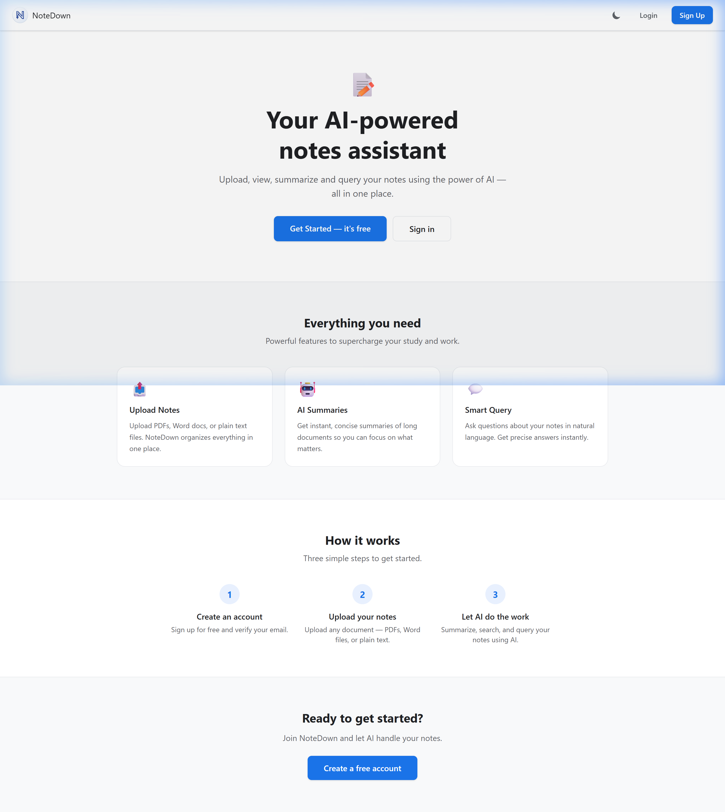

<div align="center">


<br/>

<a href="https://note-down-sooty.vercel.app" target="_blank">
  
</a>

<br/><br/>

[](https://react.dev)
[](https://vitejs.dev)
[](https://tailwindcss.com)
[](https://nodejs.org)
[](https://expressjs.com)
[](https://mongodb.com)
[](https://aws.amazon.com/s3)
[](https://vercel.com)
[](https://render.com)

<br/>



</div>

<br/>

---

## ✨ What is NoteDown?

> **NoteDown** is a community-driven, AI-powered study platform where students can upload, share, and intelligently query their study materials.

Upload a PDF, DOCX, image, or TXT file — NoteDown automatically scans it for malware, extracts its text (even from handwritten notes via OCR), runs an AI summary, and shares it with the community after admin review. Once your notes are in the system, you can **chat with them** using Gemini AI in a RAG-powered conversation interface.

**🌐 Try it live → [note-down-sooty.vercel.app](https://note-down-sooty.vercel.app)**

> 📖 For all technical details — architecture, API references, database schemas, deployment guides — visit the [`/docs`](./docs) folder in this repo.

---

## 🚀 Core Features

<table>
<tr>
<td width="50%">

### 🔒 Security & Authentication
- **JWT cookie auth** (httpOnly, secure) with role separation
- **Email OTP signup** — 6-digit code, 5-minute expiry
- **Forgot password** → email reset link flow
- **In-app password reset** with OTP verification
- **Login lockout** after repeated failures (DB-persisted, survives restarts)
- **9 granular rate limiters** protecting every sensitive endpoint
- **VirusTotal scanning** — every uploaded file is checked by 70+ antivirus engines before it ever touches S3

</td>
<td width="50%">

### 📝 Notes & Community
- Upload **PDF, DOCX, TXT** study materials
- Files land in **quarantine** until virus scan passes
- **Admin review** workflow — notes only go public after approval
- Browse the community **approved notes feed**
- Delete your own notes (S3 cleanup + storage recalculation)
- **Per-user storage cap** (100 MB) + **global cap** (4 GB) with auto-disable

</td>
</tr>
<tr>
<td width="50%">

### 🧠 AI Text Extraction & OCR
- **Smart routing**: TXT → direct read · DOCX → Mammoth · PDF → analysis
- **Handwritten PDF detection** via avg chars/page threshold (< 50)
- **Client-side OCR** using Tesseract.js + pdfjs-dist for handwritten/scanned PDFs
- **JWT-secured OCR callback** so only the uploading user can submit extracted text
- **Auto-cleanup cron job** removes stuck OCR notes after 15 minutes
- **AI summaries** powered by Gemini 2.5 Flash Lite on note approval

</td>
<td width="50%">

### 💬 AI Chat (RAG)
- Select one or more of your approved notes
- Chat with them using **LangChain + Gemini AI**
- Powered by **MongoDB Atlas Vector Search** (vector embeddings per note)
- Strict context grounding — AI only answers from your selected notes
- Full **session management** (create, view history, delete)
- Session auto-terminates if a referenced note is deleted

</td>
</tr>
<tr>
<td width="50%">

### 🎨 UI / UX
- **Dark mode** with OS preference detection + localStorage persistence (no FOUC)
- **Responsive hamburger nav** with Escape-to-close drawer
- **Maintenance mode** — admin can take site offline with a custom message
- Global loading states via `useApi` hook
- Unified `NoteCard` component reused across all note views
- Visual `StorageBar` with usage percentage

</td>
<td width="50%">

### 👑 Admin & Root Panel
- **AdminJS root panel** at `/root/panel` — full CRUD on all DB collections
- **Role-based admin access** — 16 granular roles (root, superAdmin, supervisor, manager, powerUser per entity)
- Admin **approve / reject** notes with reasons
- **AI Summary retry** button for failed summaries
- Regular admin accounts managed separately from system users

</td>
</tr>
</table>

---

## 🔐 Upload & Security Pipeline

Every file goes through a strict multi-stage pipeline before reaching the community:

```
User Uploads File
       │
       ▼
 ┌─────────────┐    ┌──────────────┐    ┌─────────────────┐
 │ Validation  │───▶│ Text Extract │───▶│ VirusTotal Scan │
 │ Size · Pages│    │ TXT/DOCX/PDF │    │ 70+ AV engines  │
 └─────────────┘    └──────────────┘    └────────┬────────┘
                           │                      │
                    ┌──────▼──────┐         ┌─────▼──────┐
                    │ Handwritten │         │  Clean File │
                    │ PDF → OCR   │         │  → S3 Store │
                    │ (Tesseract) │         └─────┬───────┘
                    └─────────────┘               │
                                           ┌──────▼──────┐
                                           │ Admin Review │
                                           │ Approve/Reject│
                                           └──────┬───────┘
                                                  │
                                           ┌──────▼──────┐
                                           │ AI Summary  │
                                           │ + Embedding │
                                           │ → Community │
                                           └─────────────┘
```

---

## 🤖 AI Chat Architecture (RAG)

```
User selects notes  ──▶  Session created with noteIds
         │
         ▼
User sends message
         │
         ▼
   Vector Search (MongoDB Atlas)
   Finds top-K relevant chunks
   filtered by noteIds
         │
         ▼
   LangChain ChatPromptTemplate
   Injects context + history + question
         │
         ▼
   Gemini 2.5 Flash Lite
   Answers ONLY from context
         │
         ▼
   Response stored as ChatMessage
   Returned to user
```

---

## 👥 Role System

| Role | Access |
|------|--------|
| **Guest** | Browse landing page only |
| **User** | Upload notes, browse community feed, chat with notes, manage profile |
| **Admin** | All of User + approve/reject notes, view all notes |
| **System User (Root Panel)** | Full DB access via AdminJS with granular RBAC (16 roles) |

---

## 📊 Feature Status

| Category | Feature | Status |
|---|---|:---:|
| **Security** | JWT cookie auth | ✅ |
| **Security** | OTP email verification | ✅ |
| **Security** | Forgot / reset password | ✅ |
| **Security** | Login lockout (DB-persisted) | ✅ |
| **Security** | VirusTotal malware scanning | ✅ |
| **Security** | 9 granular rate limiters | ✅ |
| **Notes** | File upload (PDF/DOCX/TXT) | ✅ |
| **Notes** | AWS S3 cloud storage | ✅ |
| **Notes** | Per-user + global storage caps | ✅ |
| **Notes** | Admin approval workflow | ✅ |
| **Notes** | Note deletion with S3 cleanup | ✅ |
| **OCR** | TXT / DOCX / Digital PDF extraction | ✅ |
| **OCR** | Handwritten PDF → Tesseract.js OCR | ✅ |
| **OCR** | OCR cleanup cron job | ✅ |
| **AI** | Gemini AI summaries on approval | ✅ |
| **AI** | MongoDB Atlas Vector Search | ✅ |
| **AI** | RAG chat with notes | ✅ |
| **AI** | Multi-note chat sessions | ✅ |
| **Admin** | AdminJS root panel (RBAC) | ✅ |
| **Admin** | Maintenance mode | ✅ |
| **UI** | Dark / light mode | ✅ |
| **UI** | Responsive mobile nav | ✅ |
| **UI** | Maintenance page | ✅ |

---

## 🗂️ Project Structure (Overview)

```
NoteDown/
├── 📂 frontend/          # React 19 SPA (Vite + Tailwind CSS 4)
│   └── src/
│       ├── pages/        # All page components
│       ├── components/   # Reusable UI components
│       ├── hooks/        # Custom React hooks
│       └── context/      # Auth, Theme contexts
│
├── 📂 backend/           # Express 5 API server (Node.js)
│   ├── controllers/      # Route logic (auth, notes, chat)
│   ├── models/           # Mongoose schemas
│   ├── routes/           # Express routers
│   ├── middlewares/      # Auth, rate limit, upload, maintenance
│   ├── utils/            # Extraction, email, S3, RAG, embeddings
│   └── config/           # DB, S3, AdminJS, Gemini configs
│
└── 📂 docs/              # 📖 Full technical documentation
    ├── overview.md           # Common architecture overview
    ├── backend/              # Backend technical docs
    └── frontend/             # Frontend technical docs
```

> 📖 **Full technical docs** (API reference, schemas, deployment, architecture) → [`/docs`](./docs)

---

## 🚀 Quick Start

```bash
# Clone
git clone https://github.com/UsaaryanByte07/NoteDown.git
cd NoteDown

# Backend
cd backend && npm install
# Create backend/.env (see docs/backend/01-setup-and-env.md)
npm run dev   # → http://localhost:3010

# Frontend (new terminal)
cd frontend && npm install
# Set VITE_API_URL in frontend/.env.production
npm run dev   # → http://localhost:5173
```

> 💡 Full setup guide with all environment variables → [`docs/backend/01-setup-and-env.md`](./docs/backend/01-setup-and-env.md)

---

## ☁️ Deployment

| Service | Purpose |
|---|---|
| **Vercel** | Frontend hosting (auto-deploys from `frontend/`) |
| **Render** | Backend hosting (Node.js web service) |
| **MongoDB Atlas** | Cloud database + Vector Search index |
| **AWS S3** | File storage (PDFs, DOCX, TXT) |
| **VirusTotal** | Malware scanning API |
| **Resend** | Transactional emails (OTP, password reset) |
| **Gemini API** | AI summaries + RAG chat |

> 📖 Full deployment guide → [`docs/backend/05-deployment.md`](./docs/backend/05-deployment.md)

---

## 📖 Documentation

All technical documentation lives in the [`/docs`](./docs) folder:

```
docs/
├── overview.md                    # Architecture, tech stack, common patterns
├── backend/
│   ├── 01-setup-and-env.md       # Getting started, .env reference
│   ├── 02-architecture.md        # File structure, request lifecycle
│   ├── 03-api-reference.md       # All endpoints with auth + rate limits
│   ├── 04-database-schemas.md    # All Mongoose models explained
│   └── 05-deployment.md          # Render deployment guide
└── frontend/
    ├── 01-setup-and-structure.md  # Getting started, folder layout
    ├── 02-routing-and-auth.md     # React Router, ProtectedRoute, contexts
    ├── 03-components.md           # All components documented
    ├── 04-hooks.md                # Custom hooks explained
    └── 05-deployment.md           # Vercel deployment guide
```

---

<div align="center">


**Built with ❤️ by [Aryan Upadhyay](https://github.com/UsaaryanByte07)**

</div>
