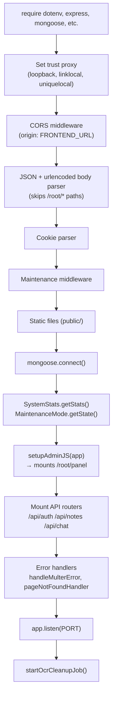
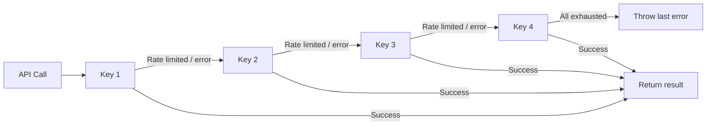

# 🏗️ Backend — Architecture & File Structure

> A complete walkthrough of every file and folder in the backend, explaining what it does and why.

---

## 📂 Directory Tree

```
backend/
├── server.js                    # Express app entry — startup & middleware wiring
├── package.json
├── nodemon.json                 # Nodemon config (ignore: temp/, public/)
│
├── config/
│   ├── db_config.js             # MongoDB connection URI export
│   ├── s3_config.js             # AWS S3 client (S3Client instance)
│   ├── email_config.js          # Resend client initialization
│   ├── virustotal_config.js     # VirusTotal scan + poll logic
│   ├── gemini_config.js         # Gemini API multi-key failover + model helpers
│   ├── adminjs-setup.js         # AdminJS panel bootstrap + /api/maintenance-status
│   └── adminjs-rbac.js          # Role-based access control for AdminJS resources
│
├── controllers/
│   ├── auth/
│   │   ├── loginController.js       # postLogin, postLogout, getMe
│   │   ├── signupController.js      # postSignup (creates user + sends OTP)
│   │   ├── verifyOtpController.js   # getVerifyOtp, postVerifyOtp
│   │   ├── forgetPasswordController.js  # postForgotPassword, getResetPassword,
│   │   │                                # postResetPassword, postResendOtp,
│   │   │                                # getCooldownStatus, postCheckAndResendOtp
│   │   └── profileController.js     # getProfile, patchProfile,
│   │                                # postRequestPasswordReset, postProfileResetPassword
│   ├── notes/
│   │   ├── userNoteController.js    # postUploadNote, getApprovedNotes,
│   │   │                            # getMyNotes, deleteMyNote, getMyStorage
│   │   ├── adminNoteController.js   # getPendingNotes, getAllNotesForAdmin,
│   │   │                            # patchApprovedNote, patchRejectedNote, patchRetrySummary
│   │   └── ocrCallbackController.js # postOcrCallback (receives OCR text from frontend)
│   └── chat/
│       ├── sessionController.js     # createSession, getMySessions,
│       │                            # getSession, deleteSession
│       └── messageController.js     # sendMessage (RAG pipeline trigger)
│
├── middlewares/
│   ├── authMiddleware.js        # requireLogin, requireUser, requireAdmin,
│   │                            # requireNotLoggedIn
│   ├── rateLimitMiddleware.js   # 8 named rate limiters (express-rate-limit)
│   ├── uploadMiddleware.js      # multer with disk storage → temp/quarantine/
│   ├── maintenanceMiddleware.js # Block all /api/* when maintenance is active
│   └── errorHandlerMiddleware.js # handleMulterError, pageNotFoundHandler
│
├── models/
│   ├── User.js                  # User schema (auth fields, storage, lockout)
│   ├── Note.js                  # Note schema (file, status, extraction, AI)
│   ├── ChatSession.js           # Chat session (userId, noteIds, title, terminated)
│   ├── ChatMessage.js           # Individual message (sessionId, role, content)
│   ├── SystemStats.js           # Singleton: globalStorageUsed, isUploadEnabled
│   ├── SystemUser.js            # AdminJS panel users (16 RBAC roles)
│   └── MaintenanceMode.js       # Singleton: isActive, message, whitelistedIps
│
├── routes/
│   ├── authRoutes.js            # /api/auth/* — 16 endpoints
│   ├── noteRoutes.js            # /api/notes/* — 11 endpoints
│   └── chatRoutes.js            # /api/chat/* — 5 endpoints
│
├── utils/
│   ├── text-extraction-util.js  # extractTextFromTxt, extractTextFromDocx,
│   │                            # analyzeDigitalPdf (handwritten detection)
│   ├── s3-util.js               # uploadToS3, deleteFromS3
│   ├── email-util.js            # HTML email templates: OTP, password reset, welcome
│   ├── embedding-util.js        # embedNoteContent, deleteNoteEmbeddings,
│   │                            # getEmbeddingsCollection, getEmbeddingModelInstance
│   ├── rag-query-util.js        # retrieveContext (vector search), generateRAGResponse
│   ├── summary-util.js          # generateSummary (Gemini AI summary on approval)
│   ├── ocr-cleanup-job.js       # Cron: auto-delete stuck OCR notes after 15 min
│   ├── page-count-util.js       # getPageCount (PDF/DOCX page validation)
│   ├── validator-util.js        # express-validator rules (signup, profile, etc.)
│   ├── maintenance-util.js      # Helpers for maintenance mode checks
│   ├── getClientIp.js           # Resolves real client IP behind proxies
│   ├── chat-termination-util.js # terminateSessionsForNote (on note deletion)
│   └── path-util.js             # __dirname of backend root (cross-OS compatible)
│
├── temp/                        # Multer quarantine directory (auto-created)
│   └── quarantine/
└── public/                      # Static files served by Express
```

---

## 🚀 Server Bootstrap (`server.js`)

The startup sequence:



> **Trust Proxy**: Set to `'loopback, linklocal, uniquelocal'` to handle Render's internal routing hops. This ensures `req.ip` reflects the real client IP for rate limiting.

---

## 🔐 Auth Middleware (`authMiddleware.js`)

Four middleware functions, all reading `req.cookies.token`:

| Function | Behavior |
|---|---|
| `requireLogin` | Verifies JWT; accepts any valid user (user or admin) |
| `requireUser` | Verifies JWT + checks `userType === 'user'` |
| `requireAdmin` | Verifies JWT + checks `userType === 'admin'` |
| `requireNotLoggedIn` | Rejects if valid JWT cookie exists (for login/signup pages) |

---

## ⏱️ Rate Limiters (`rateLimitMiddleware.js`)

All use `express-rate-limit` keyed by IP. The trust proxy setting ensures accurate IP detection on Render.

| Limiter | Window | Max Requests | Applied To |
|---|---|---|---|
| `signupRateLimiter` | 1 hour | 2 | `POST /api/auth/signup` |
| `loginRateLimiter` | 30 min | 10 | `POST /api/auth/login` |
| `forgotPasswordRateLimiter` | 15 min | 5 | `POST /api/auth/forgot-password` |
| `resendOtpRateLimiter` | 15 min | 5 | `POST /api/auth/resend-otp` |
| `resetPasswordRateLimiter` | 15 min | 2 | `POST /api/auth/reset-password` |
| `verifyOtpRateLimiter` | 15 min | 5 | `POST /api/auth/verify-otp` |
| `cooldownStatusRateLimiter` | 15 min | 60 | `GET /api/auth/cooldown-status` |
| `profileResetRateLimiter` | 1 hour | 5 | `POST /api/auth/profile/request-password-reset` |
| `uploadRateLimiter` | 5 days | 5 | `POST /api/notes/upload` |

---

## 📁 File Upload (`uploadMiddleware.js`)

Uses **multer** with disk storage. Files are saved to `temp/quarantine/<fieldname>-<timestamp>.<ext>` during processing. They are only moved to S3 after passing the VirusTotal scan. On scan failure, rejection, or timeout, the quarantine file is deleted from disk.

**Allowed MIME types**: `application/pdf`, `application/vnd.openxmlformats-officedocument.wordprocessingml.document` (DOCX), `text/plain`

---

## 🧠 Gemini Config (`config/gemini_config.js`)

Supports up to 4 API keys with automatic failover:



**Safety violations** (SAFETY, RECITATION, blocked) are **not retried** — they throw immediately because retrying another key won't fix a content policy violation.

Exports:
- `invokeChatModel(promptOrMessages)` — Chat generation
- `invokeEmbeddingModel(texts[])` — Batch embedding
- `getTextSplitter(chunkSize, chunkOverlap)` — LangChain text splitter
- `getPromptTemplate()` — LangChain ChatPromptTemplate
- `getDocument()` — LangChain Document class

---

## 🧹 OCR Cleanup Job (`utils/ocr-cleanup-job.js`)

Runs every **5 minutes** via `setInterval`. Finds notes where:
- `ocrRequired === true`
- `extractionComplete === false`
- `createdAt < (now - 15 minutes)`

These are "stuck" notes where the user uploaded a handwritten PDF but the browser OCR never completed (tab closed, network error, etc.). The job deletes them from DB and removes the quarantine file from disk.

---

## 📧 Email Templates (`utils/email-util.js`)

HTML emails sent via Resend for:
- **OTP Verification** — 6-digit code, styled HTML email
- **Forgot Password Reset** — Secure link with token
- **In-App Password Reset OTP** — Same 6-digit format
- **Admin Welcome Email** — Sent when a new admin is created via root panel

---

## 🏛️ AdminJS Root Panel (`config/adminjs-setup.js` + `config/adminjs-rbac.js`)

Mounted at `/root/panel`. Uses:
- `adminjs` v7 + `@adminjs/express` + `@adminjs/mongoose`
- Session stored in MongoDB (`adminjs_sessions` collection) via `connect-mongo`
- Authentication against `SystemUser` model (username + bcrypt password)
- Login field relabeled from "Email" to "Username" via i18n locale override

**RBAC** is enforced per-resource using `buildResourceConfig()`:
- Reads the logged-in `SystemUser.role`
- `isAccessible` hooks check role against entity-specific permission tables
- 16 roles: `root`, `chatSuperAdmin`, `userSuperAdmin`, ... `statsPowerUser`

**Extra endpoints registered by AdminJS setup**:
- `GET /api/maintenance-status` — Returns maintenance state (checked by frontend on load)
- `GET /api/my-ip` — Returns the server's view of the request IP (useful for whitelist setup)
