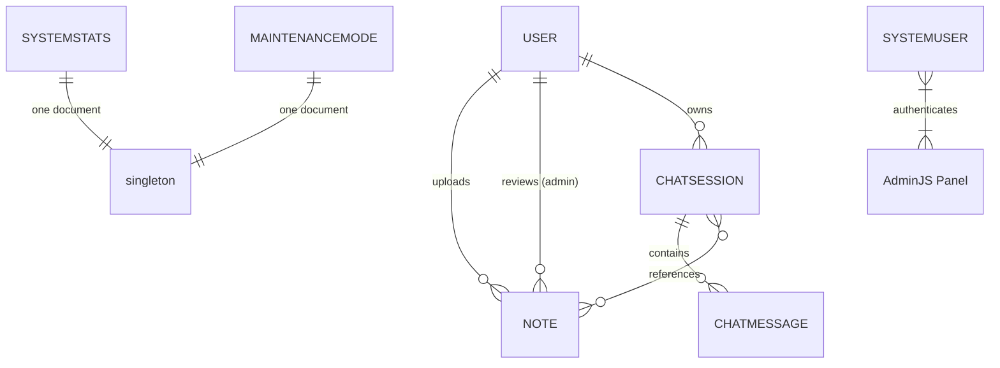
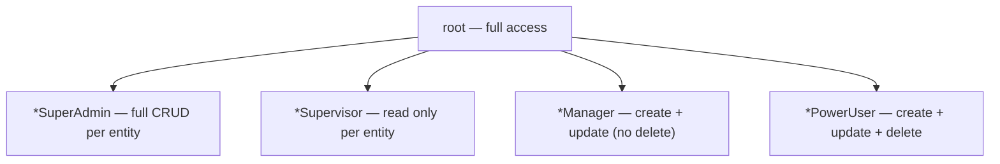

# 🗄️ Backend — Database Schemas

> All Mongoose models explained — fields, types, defaults, and relationships.

---

## 📊 Entity Relationship Overview



---

## 👤 User

**File:** `models/User.js` | **Collection:** `users`

| Field | Type | Default | Description |
|---|---|---|---|
| `_id` | ObjectId | auto | Primary key |
| `firstName` | String | required | — |
| `lastName` | String | required | — |
| `email` | String | required, unique | — |
| `password` | String | required | bcrypt hash (rounds=10) |
| `userType` | String | required | `'user'` or `'admin'` |
| `otp` | String | `""` | Current OTP code |
| `otpExpiry` | Date | `Date.now` | OTP expiration |
| `isVerified` | Boolean | `false` | Email verified? |
| `resetToken` | String | `""` | Forgot-password reset token |
| `resetTokenExpiry` | Date | `Date.now` | Reset token expiration |
| `totalStorageUsed` | Number | `0` | Bytes used (cap: 100 MB) |
| `failedLoginAttempts` | Number | `0` | Incremented on wrong password |
| `lockUntil` | Date | `null` | Future date = account locked |
| `createdAt` / `updatedAt` | Date | auto | Mongoose timestamps |

**Lockout logic**: When `failedLoginAttempts` reaches the threshold, `lockUntil` is set to a future date. Login checks `lockUntil > Date.now()` before attempting password comparison. Successfully logging in resets both fields. Stored in DB so lockouts **survive server restarts**.

---

## 📄 Note

**File:** `models/Note.js` | **Collection:** `notes`

| Field | Type | Default | Description |
|---|---|---|---|
| `_id` | ObjectId | auto | — |
| `title` | String | required | User-provided note title |
| `description` | String | `""` | Optional description |
| `fileUrl` | String | `""` | AWS S3 public-ish URL (pre-signed at read time) |
| `fileKey` | String | `""` | S3 object key for deletion |
| `fileSize` | Number | required | Bytes |
| `fileName` | String | required | Original filename |
| `mimeType` | String | required | `application/pdf`, `application/vnd...docx`, `text/plain` |
| `uploader` | ObjectId → User | required | Who uploaded it |
| `reviewedBy` | ObjectId → User | `null` | Admin who reviewed it |
| `reviewedAt` | Date | `null` | When it was reviewed |
| `rejectionReason` | String | `""` | Admin rejection reason |
| `scanResult` | String | `""` | VirusTotal result (e.g., "clean") |
| `scanAnalysisId` | String | `null` | VirusTotal analysis ID for polling |
| `quarantinePath` | String | `null` | Local disk path while scanning |
| `status` | String | `"scanning"` | `scanning` → `pending` → `approved` or `rejected` |
| `extractedTextDraft` | String | `null` | Text extracted pre-scan (moved to `extractedText` on approval) |
| `extractedText` | String | `null` | Final extracted text (used for chat + embedding) |
| `ocrRequired` | Boolean | `false` | Handwritten PDF needs client OCR? |
| `extractionComplete` | Boolean | `false` | OCR callback received? |
| `ocrToken` | String | `null` | JWT for OCR callback (15-min expiry) |
| `aiSummary` | String | `null` | Gemini-generated summary |
| `summaryStatus` | String | `"none"` | `none` / `generating` / `completed` / `failed` |
| `createdAt` / `updatedAt` | Date | auto | — |

**Status flow:**
```
scanning → (VT clean) → pending → (admin) → approved
                                         → rejected
         → (VT malicious / timeout) → rejected
```

---

## 💬 ChatSession

**File:** `models/ChatSession.js` | **Collection:** `chatsessions`

| Field | Type | Default | Description |
|---|---|---|---|
| `_id` | ObjectId | auto | — |
| `userId` | ObjectId → User | required | Session owner |
| `noteIds` | [ObjectId → Note] | required | Notes selected for this chat |
| `title` | String | required | Session display name |
| `isTerminated` | Boolean | `false` | Terminated when a note is deleted |
| `terminatedAt` | Date | `null` | — |
| `terminationReason` | String | `null` | Reason for termination |
| `createdAt` / `updatedAt` | Date | auto | — |

---

## 💬 ChatMessage

**File:** `models/ChatMessage.js` | **Collection:** `chatmessages`

| Field | Type | Description |
|---|---|---|
| `_id` | ObjectId | — |
| `sessionId` | ObjectId → ChatSession | Parent session |
| `role` | String | `'user'` or `'ai'` |
| `content` | String | Message text (markdown supported) |
| `createdAt` / `updatedAt` | Date | — |

---

## 📊 SystemStats

**File:** `models/SystemStats.js` | **Collection:** `systemstats` (singleton — always exactly 1 document)

| Field | Type | Default | Description |
|---|---|---|---|
| `globalStorageUsed` | Number | `0` | Total bytes across all users |
| `totalNotesUploaded` | Number | `0` | Counter (never decremented) |
| `isUploadEnabled` | Boolean | `true` | Set to false when ≥ 4 GB used |

**Static method**: `SystemStats.getStats()` — returns the singleton, creating it if it doesn't exist.

---

## 🔧 MaintenanceMode

**File:** `models/MaintenanceMode.js` | **Collection:** `maintenancemodes` (singleton)

| Field | Type | Default | Description |
|---|---|---|---|
| `isActive` | Boolean | `false` | Is the site in maintenance? |
| `message` | String | `""` | Message shown to users |
| `endsAt` | Date | `null` | Estimated end time |
| `whitelistedIps` | [String] | `[]` | IPs that bypass maintenance |
| `activatedAt` | Date | `null` | When maintenance was enabled |

**Static method**: `MaintenanceMode.getState()` — returns the singleton (or most recent if multiple exist), deduplicating extras.

---

## 👑 SystemUser

**File:** `models/SystemUser.js` | **Collection:** `systemusers`

| Field | Type | Description |
|---|---|---|
| `name` | String | Display name |
| `username` | String, unique | Login username for AdminJS panel |
| `password` | String | bcrypt hash |
| `role` | String | One of 16 roles (see below) |

**16 RBAC Roles:**



Entities: `chat`, `user`, `notes`, `stats`

Example roles: `chatSuperAdmin`, `userSupervisor`, `notesManager`, `statsPowerUser`

---

## 🔍 note_embeddings

**Collection:** `note_embeddings` (not a Mongoose model — raw MongoDB collection used by LangChain)

Created automatically by `MongoDBAtlasVectorSearch.addDocuments()`.

| Field | Type | Description |
|---|---|---|
| `_id` | ObjectId | — |
| `text` | String | Text chunk (500 chars, 50 overlap) |
| `embedding` | [Number] | 768-dimension vector (gemini-embedding-001) |
| `noteId` | String | References the source Note's `_id` (as string) |

> **Important**: LangChain flattens `Document.metadata` to the top level when storing. So `noteId` is a top-level field, not `metadata.noteId`. The Atlas vector index filter path must use `"noteId"` accordingly.
