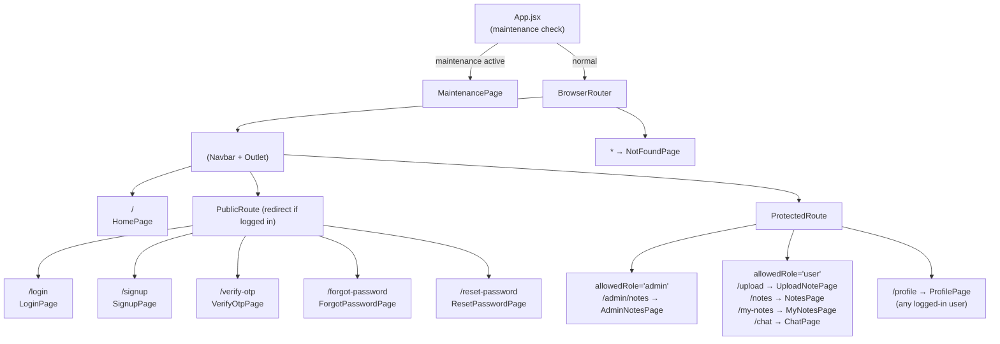
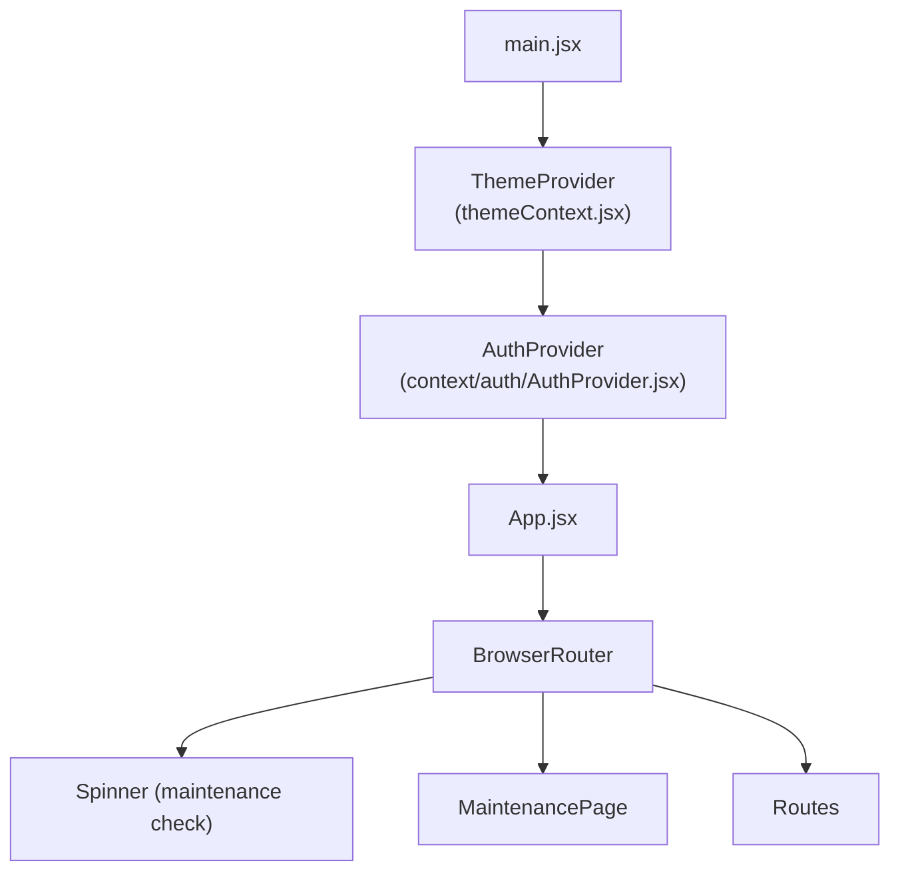
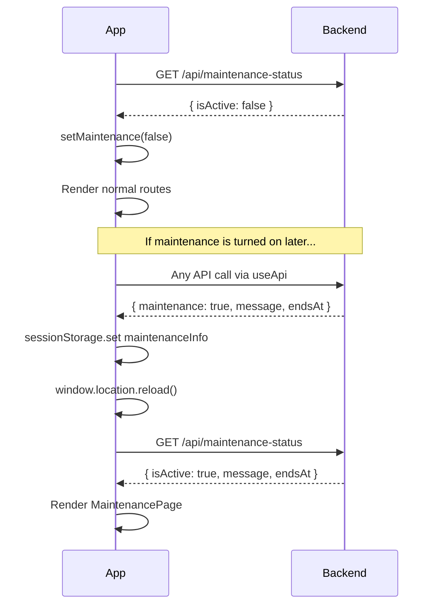

# 🔀 Frontend — Routing, Auth & Contexts

> How React Router is configured, how route guards work, and how global state is managed.

---

## 🗺️ Route Map

All routes are defined in `App.jsx` using React Router DOM v7.



---

## 🔒 Route Guards

### `ProtectedRoute.jsx`

Reads the current user from `AuthContext`. If the user is not logged in, redirects to `/login`. If `allowedRole` is specified and doesn't match `user.userType`, redirects to `/`.

```jsx
<ProtectedRoute allowedRole="user">
  <UploadNotePage />
</ProtectedRoute>
```

### `PublicRoute.jsx`

Redirects to `/` if the user is already logged in (prevents accessing login/signup when authenticated).

---

## 🌍 Context Architecture



---

## 🎨 ThemeContext (`context/themeContext.jsx`)

Manages dark/light mode with zero Flash Of Unstyled Content (FOUC).

**Priority**: `localStorage` → OS preference → `'light'`

```js
const getInitialTheme = () => {
    const stored = localStorage.getItem('notedown-theme');
    if (stored === 'dark' || stored === 'light') return stored;
    if (window.matchMedia('(prefers-color-scheme: dark)').matches) return 'dark';
    return 'light';
};
```

- Theme is applied by adding/removing the `.dark` class on `<html>`
- Tailwind CSS v4 uses the `dark` class strategy
- Listens for OS-level changes via `matchMedia` — but only auto-switches if user has no saved preference
- **Exports**: `{ theme, toggleTheme }` via `useTheme()` hook

---

## 👤 AuthContext (`context/auth/`)

### `AuthProvider.jsx`

On mount, fetches `GET /api/auth/me` to check if the user has a valid JWT cookie. Sets `user` in context if logged in, `null` otherwise.

**Exported state via `useAuth()`:**
```js
{
  user: null | { _id, firstName, lastName, email, userType, isVerified, totalStorageUsed },
  setUser: Function,   // called after login/signup/profile update
  loading: Boolean     // true while initial /me fetch is pending
}
```

### Usage pattern

```jsx
const { user, setUser } = useAuth();

// After successful login
setUser(responseData.user);

// After logout
setUser(null);

// Route guard check
if (!user) return <Navigate to="/login" />;
if (user.userType !== 'admin') return <Navigate to="/" />;
```

---

## 🔄 Maintenance Mode Flow



---

## 📐 Layout (`components/Layout.jsx`)

Simple wrapper that renders `<Navbar />` above `<Outlet />`. All routes nested inside the Layout route inherit the Navbar automatically.

```jsx
// Layout.jsx
return (
  <>
    <Navbar />
    <Outlet />
    <Footer />
  </>
);
```

---

## 🍔 Navbar (`components/Navbar.jsx`)

- Shows different links based on `user.userType` (`user`, `admin`, or logged out)
- **Hamburger drawer** for mobile — opens with button click, closes on Escape key or outside click
- **Dark mode toggle** button using `useTheme()`
- Active link styling via React Router's `NavLink`
