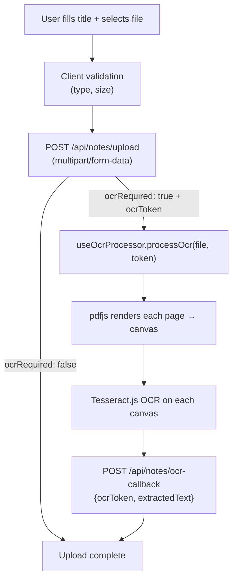

# 🧩 Frontend — Components

> Every reusable component documented — props, responsibilities, and where it's used.

---

## 🃏 NoteCard (`components/notes/NoteCard.jsx`)

The unified card component used across **3+ pages**: community feed, my notes, and admin review.

### Props

| Prop | Type | Description |
|---|---|---|
| `note` | Object | Full note document from API |
| `showStatus` | Boolean | Show status badge (scanning/pending/approved/rejected) |
| `showDelete` | Boolean | Show delete button (my notes page) |
| `showAdminActions` | Boolean | Show approve/reject buttons (admin page) |
| `onDelete` | Function | Callback after successful deletion |
| `onStatusChange` | Function | Callback after admin approve/reject |

### Features

- **Status badge** — color-coded: scanning (blue), pending (yellow), approved (green), rejected (red)
- **File type icon** — PDF / DOCX / TXT
- **AI Summary** — shown if `note.summaryStatus === 'completed'`, with a "Retry" button for failed ones
- **Download** — for approved notes
- **Delete** — calls `DELETE /api/notes/my-notes/:id`, triggers `onDelete` callback

---

## 📊 StorageBar (`components/notes/StorageBar.jsx`)

Visual progress bar showing how much storage the user has used.

### Props

| Prop | Type | Description |
|---|---|---|
| `used` | Number | Bytes used |
| `total` | Number | Total cap in bytes (100 MB = 104857600) |

Displays used/total as human-readable (MB), with a color-coded bar (green → yellow → red as it fills up).

---

## 📤 UploadForm (`components/notes/UploadForm.jsx`)

The file upload form that handles the entire upload + OCR pipeline.

### Flow



Uses `useOcrProcessor` hook internally. Shows OCR progress (`ocrStatus`, `ocrProgress`) to the user during processing.

---

## 👤 Profile Components (`components/profile/`)

### `ProfileInfo.jsx`
Displays user's name, email, verified status, and storage usage (`StorageBar`).

### `EditProfileModal.jsx`
Modal with a form to update `firstName` and `lastName`. Calls `PATCH /api/auth/profile`. On success, updates `AuthContext` via `setUser`.

### `ResetPasswordSection.jsx`
In-app password reset flow:
1. Click "Request OTP" → `POST /api/auth/profile/request-password-reset`
2. OTP sent to email with a 60-second cooldown (`useCooldownTimer`)
3. Enter OTP + new password → `POST /api/auth/profile/reset-password`

---

## 💬 Chat Components (`components/chat/`)

### `NoteSelector.jsx`
Multi-select UI for choosing which approved notes to include in a chat session. Fetches the user's approved notes and renders checkboxes. Creates the session on confirmation via `POST /api/chat/sessions`.

### `SessionSidebar.jsx`
Left sidebar listing all past chat sessions. Clicking a session loads it. Has a "New Chat" button that opens `NoteSelector`.

### `ChatWindow.jsx`
The main message area. Renders a list of `MessageBubble` components, auto-scrolls to the latest message.

### `ChatInput.jsx`
Text input + send button. Disabled when a response is loading. Handles Enter key submission.

### `MessageBubble.jsx`
Individual message. User messages on the right, AI messages on the left. AI responses support markdown rendering.

---

## 🛡️ ProtectedRoute (`components/ProtectedRoute.jsx`)

```jsx
<ProtectedRoute allowedRole="user">
  <UploadNotePage />
</ProtectedRoute>
```

- If `AuthContext.loading === true`: renders a `<Spinner />`
- If `!user`: redirects to `/login`
- If `allowedRole` is set and `user.userType !== allowedRole`: redirects to `/`
- Otherwise: renders `children`

---

## 🚪 PublicRoute (`components/PublicRoute.jsx`)

Wraps auth pages (login, signup, etc.). If the user is already logged in (`user !== null`), redirects to `/`. Prevents authenticated users from accessing the login screen.

---

## ⏳ Spinner (`components/Spinner.jsx`)

```jsx
<Spinner size="sm" />  // small inline spinner
<Spinner size="lg" />  // full-page centered spinner
```

Used for: global loading state in `AuthProvider`, maintenance check, and within page components.
