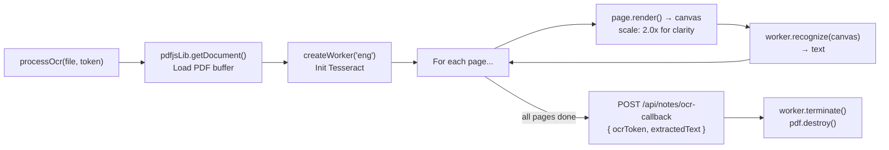

# 🪝 Frontend — Custom Hooks

> Every custom hook explained — what it does, how to use it, and what it returns.

---

## `useApi` — Mutation Hook

**File:** `hooks/useApi.jsx`

For **user-triggered** API calls (POST, PATCH, DELETE). Does **not** run on mount.

```js
const { error, loading, statusCode, executeRequest } = useApi();

const result = await executeRequest('/api/auth/login', {
  method: 'POST',
  body: JSON.stringify({ email, password }),
});

if (result.success) {
  // result.data contains the parsed JSON response
} else {
  // result.data still available for reading specific fields
  // error state is also set automatically
}
```

### Key Behaviors

- **Never throws** — always returns `{ success, data }` so callers don't need try/catch
- Auto-detects `FormData` vs JSON and sets `Content-Type` accordingly
- Handles **maintenance mode**: if response contains `{ maintenance: true }`, stores info in `sessionStorage` and reloads the page
- Parses `data.errors[0].msg` from express-validator errors into a human-readable `error` string

### Return Values

| Value | Type | Description |
|---|---|---|
| `error` | String \| null | Last error message |
| `loading` | Boolean | Request in progress |
| `statusCode` | Number \| null | Last HTTP status code |
| `executeRequest` | Function | `async (url, fetchOptions) => { success, data }` |

---

## `useFetch` — Data Fetch Hook

**File:** `hooks/useFetch.jsx`

For **automatic** GET requests that run when a component mounts.

```js
const { data, loading, error, refetch } = useFetch('/api/notes/my-notes');
```

### Return Values

| Value | Type | Description |
|---|---|---|
| `data` | Any \| null | Parsed JSON response |
| `loading` | Boolean | Fetch in progress |
| `error` | String \| null | Error message |
| `refetch` | Function | Manually re-trigger the fetch |

---

## `useOcrProcessor` — Client-Side OCR Pipeline

**File:** `hooks/useOcrProcessor.jsx`

Orchestrates the full handwritten PDF → text pipeline in the browser.

```js
const { ocrStatus, ocrProgress, ocrError, processOcr } = useOcrProcessor();

// Call after upload returns ocrRequired: true
await processOcr(file, ocrToken);
```

### Pipeline Steps



### `ocrStatus` States

| Status | Meaning |
|---|---|
| `null` | Not started |
| `"loading"` | Loading PDF buffer |
| `"processing"` | OCR running (page by page) |
| `"sending"` | Sending text to backend |
| `"complete"` | Done successfully |
| `"error"` | Failed (see `ocrError`) |

### `ocrProgress`
A human-readable string like `"Processing page 3 of 7..."` — suitable for displaying directly in the UI.

---

## `useCooldownTimer` — OTP Resend Countdown

**File:** `hooks/useCooldownTimer.jsx`

Manages OTP resend cooldown. Fetches the remaining cooldown from the backend on mount, then counts down locally.

```js
const { cooldownRemaining, isCooldownActive, startCooldown } = useCooldownTimer();
```

### How It Works

1. On mount: calls `GET /api/auth/cooldown-status` to get remaining seconds (from DB)
2. If cooldown is active, starts a `setInterval` countdown
3. `startCooldown(seconds)` — call this after a successful OTP send to start the timer

### Return Values

| Value | Type | Description |
|---|---|---|
| `cooldownRemaining` | Number | Seconds remaining (0 if not active) |
| `isCooldownActive` | Boolean | `cooldownRemaining > 0` |
| `startCooldown` | Function | `(seconds) => void` — starts countdown |

---

## `useChatApi` — Chat API Wrapper

**File:** `hooks/useChatApi.jsx`

A thin wrapper around `useApi` with pre-built functions for chat operations.

```js
const { sendMessage, createSession, deleteSession, loading } = useChatApi();
```

### Functions

| Function | API Call | Description |
|---|---|---|
| `sendMessage(sessionId, text)` | `POST /api/chat/sessions/:id/messages` | Send user message |
| `createSession(title, noteIds)` | `POST /api/chat/sessions` | Create new chat session |
| `deleteSession(sessionId)` | `DELETE /api/chat/sessions/:id` | Delete session + messages |

---

## 💡 Hook Design Principles

1. **`useApi` never throws** — callers can always safely access `result.data?.someField`
2. **`useFetch` auto-runs** on mount, `useApi` is manually triggered — matching data-fetching vs mutation patterns
3. **`useOcrProcessor` is self-contained** — it handles cleanup (`worker.terminate()`, `pdf.destroy()`) in a `finally` block even if an error occurs
4. **Hooks compose** — `useOcrProcessor` uses `useApi` internally for the callback request
