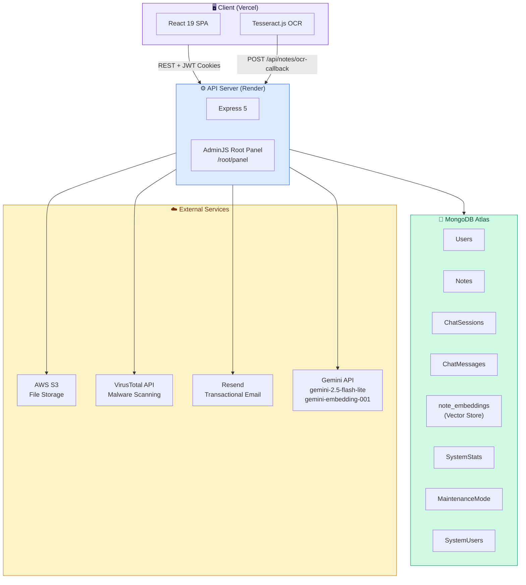
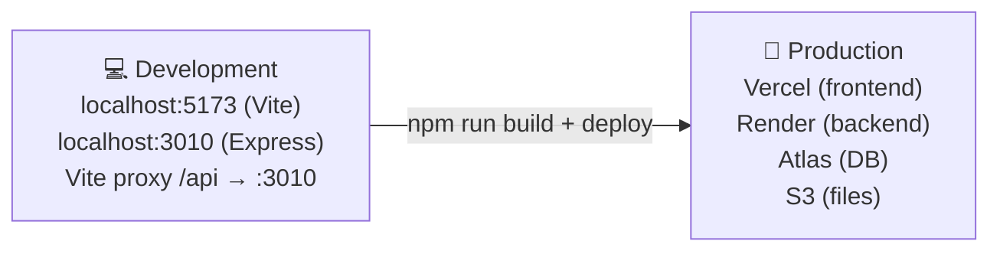
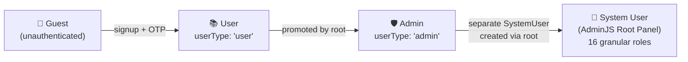
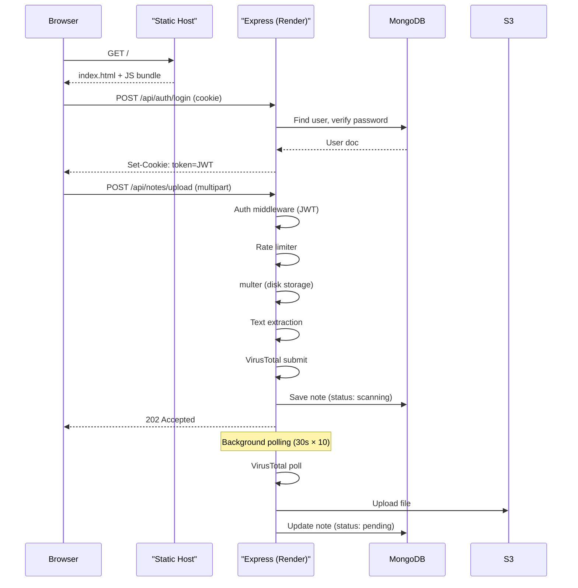

# 📐 NoteDown — Project Overview

> This document covers the high-level architecture, tech stack, shared patterns, and cross-cutting concerns that apply to both the frontend and backend. For service-specific docs, see the [`backend/`](./backend/) and [`frontend/`](./frontend/) sub-folders.

---

## 🗺️ Table of Contents

- [System Architecture](#-system-architecture)
- [Tech Stack](#-tech-stack)
- [Environment Overview](#-environment-overview)
- [Role System](#-role-system)
- [Shared Patterns](#-shared-patterns)
- [Data Flow: Full Request Lifecycle](#-data-flow-full-request-lifecycle)
- [Key Design Decisions](#-key-design-decisions)

---

## 🏗️ System Architecture

NoteDown uses a classic **client ↔ REST API ↔ database** pattern with additional cloud services for storage, scanning, email, and AI.



---

## 🛠️ Tech Stack

### Frontend

| Technology | Version | Role |
|---|---|---|
| React | 19.x | UI component library |
| Vite | 8.x | Build tool & dev server |
| Tailwind CSS | 4.x | Utility-first styling |
| React Router DOM | 7.x | Client-side routing + guards |
| Tesseract.js | 7.x | In-browser OCR for handwritten PDFs |
| pdfjs-dist | 5.x | Render PDF pages to canvas for OCR |

### Backend

| Technology | Version | Role |
|---|---|---|
| Node.js | 18+ | Runtime |
| Express | 5.x | HTTP framework |
| Mongoose | 9.x | MongoDB ODM |
| bcryptjs | 3.x | Password hashing |
| jsonwebtoken | 9.x | JWT auth tokens |
| express-rate-limit | 8.x | IP-based rate limiting |
| multer | 2.x | Multipart file upload |
| mammoth | 1.x | DOCX → text extraction |
| pdf-parse | 2.x | Digital PDF text extraction |
| AdminJS + adapters | 7.x | Root admin panel |
| LangChain (Google) | 1.x / 2.x | RAG chain, embeddings |
| resend | 6.x | Transactional email |

### Cloud & Infrastructure

| Service | Purpose |
|---|---|
| **MongoDB Atlas** | Cloud MongoDB + Atlas Vector Search index |
| **AWS S3** | File storage (PDFs, DOCX, TXT) |
| **VirusTotal API** | Scans every uploaded file with 70+ AV engines |
| **Resend** | OTP emails, password reset, welcome emails |
| **Gemini API** | AI summaries (`gemini-2.5-flash-lite`) + vector embeddings (`gemini-embedding-001`) |
| **Vercel** | Frontend hosting with SPA rewrites |
| **Render** | Backend Node.js hosting |

---

## 🌍 Environment Overview



**Dev**: Vite proxies `/api/*`, `/root/*` to Express at `:3010`, so no CORS issues locally.

**Prod**: Frontend is a static build on Vercel. `vercel.json` has a catch-all rewrite to `index.html` for SPA routing. Backend runs on Render with `FRONTEND_URL` set for CORS.

---

## 👥 Role System



| Role | Token | Key Permissions |
|---|---|---|
| **User** | JWT cookie (`token`) | Upload notes, view feed, chat with notes, profile |
| **Admin** | JWT cookie (`token`) | All user actions + approve/reject notes |
| **System User** | AdminJS session cookie | Full DB CRUD via admin panel with RBAC |

> **Important:** Regular users and admins share the same `User` model, distinguished by `userType`. System users are a completely separate `SystemUser` model used only for the AdminJS panel.

---

## 🔄 Shared Patterns

### JWT Cookie Strategy

All regular auth uses **httpOnly cookies** named `token`. The cookie is set on login/signup and cleared on logout. Middleware reads `req.cookies.token` — no Authorization header needed.

The AdminJS root panel uses its own separate session cookie (`adminjs-root`) backed by MongoDB session store — completely isolated from user JWTs.

### API Response Shape

All backend controllers follow this consistent shape:

```json
// Success
{ "success": true, "message": "...", "data": { ... } }

// Error
{ "success": false, "message": "Human-readable error", "errorCode": "RATE_LIMIT_EXCEEDED" }
```

### Error Codes

| `errorCode` | Meaning |
|---|---|
| `RATE_LIMIT_EXCEEDED` | Too many requests from this IP |
| `MAINTENANCE` | Site is in maintenance mode |

### Maintenance Mode

The `MaintenanceMode` singleton in MongoDB controls site-wide maintenance. When active:
- The backend middleware intercepts all `/api/*` requests and returns `{ maintenance: true }`
- The frontend `useApi` hook detects this and triggers a full page reload
- `App.jsx` checks `/api/maintenance-status` on mount and renders `MaintenancePage` if active
- Specific IPs can be whitelisted to bypass maintenance (admin access during downtime)

---

## 🔁 Data Flow: Full Request Lifecycle



---

## 🧩 Key Design Decisions

### 1. Client-Side OCR
Handwritten PDFs are OCR'd **in the browser** using Tesseract.js + pdfjs-dist. This offloads CPU-heavy processing to the user's machine, keeps server costs low, and avoids Render's compute limits. A JWT token authorizes the OCR callback, expiring in 15 minutes.

### 2. Gemini API Key Failover
The backend supports up to **4 Gemini API keys** (`GEMINI_API_KEY_1` through `_4`). `gemini_config.js` implements round-robin failover — if one key hits a rate limit or fails, it automatically tries the next, making the AI layer resilient.

### 3. LangChain with MongoDB Atlas Vector Search
Embeddings for each note's extracted text are stored as chunks in a `note_embeddings` collection. LangChain's `MongoDBAtlasVectorSearch` performs similarity search with `$or` prefilters on `noteId` to scope results to selected notes only.

### 4. AdminJS RBAC
The root panel has 16 distinct roles (root, superAdmin, supervisor, manager, powerUser — per entity: user, note, chat, stats). Access is enforced in `adminjs-rbac.js` using AdminJS's `isAccessible` hooks, not just at the route level.

### 5. Storage Tracking
File sizes are tracked at two levels:
- **Per-user**: `User.totalStorageUsed` (bytes) — capped at 100 MB
- **Global**: `SystemStats.globalStorageUsed` (bytes) — capped at 4 GB, disables all uploads when reached

Both are updated atomically on upload success, deletion, and rejection.
